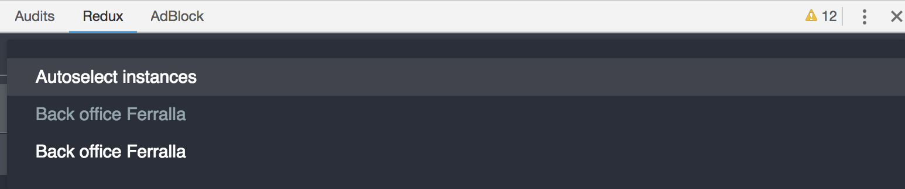

# Back office Ferralla  
  
* [Descripción](#descripción)
	* [Tecnología y diseño](#tecnología-y-diseño)
	* [Requisitos no funcionales](#requisitos-no-funcionales)
	* [Requisitos funcionales](#requisitos-funcionales)
		* [Aplicación Onsite](#aplicación-onsite)
			* [User stories](#user-stories)
		* [Aplicación Backoffice](#aplicación-backoffice)
			* [User stories](#user-stories)
		* [Notas](#notas)
	* [Especificaciones](#especificaciones)
	* [KPIs en backoffice](#kpis-en-backoffice)
	* [Iniciar el proyecto](#iniciar-el-proyecto)  
	* [Tareas *npm*](#tareas-npm)
	* [Inter comunicación entre aplicaciones](#inter-comunicación-entre-aplicaciones)  
	* [Contras](#contras)
	* [Multiple aplicaciones angular](#multiple-aplicaciones-angular)
* [Estructura](#estructura)
* [Tareas desarrolladas](#tareas-desarrolladas)
	* [Requisitos no funcionales](#requisitos-no-funcionales)
	* [Requisitos funcionales](#requisitos-funcionales)
		* [Aplicación On-site](#aplicación-on-site)
		* [Aplicación Back-office](#aplicación-back-office)
  
## Descripción  
  
Para destacar en el competitivo mundo de las estructuras de hormigón armado, nuestro cliente nos ha pedido una aplicación cloud para gestionar fácilmente los pedidos de barras de acero.

Su principal objetivo es simplificar el proceso mejorando la comunicación entre los jefes de obra (on site) y los responsables de compras (backoffice). Además, el cliente se encuentra inmerso en un proceso de transformación digital y es consciente del potencial transformador de una gestión de procesos en la nube, por lo que quiere que este sea el primer paso de una gran plataforma donde desarrollará los principales procesos operacionales de su negocio.

### Tecnología y diseño

Como primera aproximación a la solución, planteamos la elaboración de un prototipo de dos aplicaciones cliente: una para los usuarios on-site y otra para los de backoffice. Por ahora, no necesitaremos un backend y trabajaremos solamente con datos de muestra.

Para ambas aplicaciones se ha optado por emplear Angular 6. Podrás emplear el boilerplate con el que te sientas más cómodo, incluyendo tus herramientas habituales de trabajo como Webpack /Parcel, etc.

Para esta fase de prototipado el diseño no es importante por lo que no se tendrá en cuenta, la UI ha de ser mínimamente clara para un usuario técnico, pero no consideraremos la estética.

### Requisitos no funcionales

1.  Ambas aplicaciones deben alojarse en el mismo repositorio.
    
2.  Ambas aplicaciones deben reutilizar tanto código como sea posible.
    

### Requisitos funcionales

#### Aplicación Onsite

Esta primera aplicación está destinada a los usuarios on-site, típicamente jefes de obra, por lo que su principal cometido será permitir gestionar las barras de armado pedidas.

##### User stories:

1. El usuario puede ver en pantalla todas las barras pedidas.

Cargadas desde el archivo json proporcionado al iniciar la aplicación.

#### Aplicación Backoffice

Esta segunda aplicación está orientada a los usuarios del backoffice, por lo que su principal cometido es ofrecer una visión general del estado de los pedidos, así como aceptar o rechazar pedidos de barras de armado.

##### User stories:

1.  El usuario puede consultar los KPIs predefinidos.
    
    Ver el apartado Especificación.
    
2.  El usuario puede consultar la lista de barras pedidas.
    
    Cargadas del json al iniciar la aplicación. Pero no eliminarlas ni añadir nuevas.
    

#### Notas:

1. Los cambios no deben persistirse más allá del estado de la aplicación.

### Especificaciones

A continuación, se detalla el formato en el que se describen las barras de acero, comentando los principales campos:

-   valid: indica si la barra es apta o no para producción
    
-   total: número de barras pedidas (unidades)
    
-   diameter: diámetro de la barra
    
-   type: tipo de barra
    
-   a-u: parámetros que definen la barra
    
-   steelsort: calidad del acero empleado
    
-   radius: radio de doblado de la barra
    
-   leadtime: tiempo previsto para la producción

	````json
	{  
		"valid": true,
		"prefix": 22, 
		"pcgr": 93, 
		"gr": 39, 
		"total": 4, 
		"diameter": 6, 
		"type": "986", 
		"length": null, 
		"a": 144,
		"b": 72,  
		"c": 133,  
		"d": 118,  
		"e": 50,  
		"f": 149,  
		"g": 154,  
		"x": 97,  
		"y": 279,  
		"v": 129,  
		"s": 34,  
		"t": 228,  
		"u": 118,  
		"totalweight": null, 
		"steelsort": "A 1500 SD", 
		"radius": 10,
		"rev": "B",
		"leadtime": "1d." 
	},
	````

### KPIs en backoffice

A continuación, se presenta una lista de los indicadores a mostrar en el backoffice:

-   Número total de barras.
    
-   Ratios de barras válidas/inválidas sobre el total.
    
-   Cantidad de barras por cada diámetro.
    
-   Cantidad de barras por cada tipo de barra.
    
-   Cantidad de barras por cada tipo de acero.
    
#### Sugerencia:
    
-   No es necesario incluir representaciones gráficas de los KPIs, el valor calculado puede ser suficiente.
  
### Iniciar el proyecto  
  
1. Clonar el proyecto
2. Ejecutar los comandos
	- `cd mocks`
	- `npm i`
	- `npm run serve`
3. Ejecutar los comandos  
   - `cd client`  
   - `npm i`  
   - `npm run watch`  
4. Abrir http://localhost:9000  en el navegador   
  
Cuando se instala el proyecto principal, la tarea `preinstall` del *package.json*, hará las instalaciones de los diferentes proyectos que se encuentran en *apps*.  
  
### Tareas *npm*  
  
- *`watch:portal`* - Crea la aplicación como un módulo *UMD* con la libería *singleSPA* como middleware para consumir la aplicación en el contenedor. Los cambios se detectarán automáticamente.  
  
- *`build:portal`* -  Lanza la aplicación como módulo *UMD* y emite todo el contenido en una carpeta temporal. Puede cargar el archivo producido en producción en un servidor web. **Sugerencia**: las aplicaciones se están compilando con AOT. Se puede usar `npm run build:portal -- --env.analyzeBundel` para ver que no existe *compiler.js* dentro del paquete.  
  
### Inter comunicación entre aplicaciones  
  
Este es uno de los puntos importantes ya que nos aporta grandes ventajas y para ello existen muchas soluciones que resuelven este problema, pero nosotros buscamos una solución que cumpla los siguientes requisitos:  
  
- Cada aplicación es un sistema autónomo, por lo tanto, ninguna aplicación conoce el estado interno de las otras o su modelo de datos. En resumen, cada aplicación se trata como una caja negra y puede ser mantenida por un equipo diferente.  
- Cada aplicación puede tener un estado complejo  
- Cuando navegamos entre aplicaciones, el estado no debe perderse, debido al ciclo de vida (*mount*/*unmount*).  
  
Para cumplir con estos requisitos, se ha decidido crear un ecosistema de eventos en el que cada aplicación pueda o no escuchar los eventos que envían otras aplicaciones. Esto permite que cada una mantenga su estado aislado y modifique solo su propio estado en función de eventos de otras aplicaciones. Ninguna aplicación necesita acceso directo al estado de otra.  
  
Además, se necesita dividir las aplicaciones en dos partes. Una es la propia aplicación normal (*GUI, Framework, etc ...*) y la otra es una "*capa de comunicación*" que se exporta como un módulo separado y se instancia en el portal, independientemente del estado de la aplicación. Esto nos permitirá que cada aplicación escuche y reaccione ante eventos incluso si no están montados.  
  
Cada una de ellas puede procesar estos eventos de la forma que quiera. El único requisito es que todas las aplicaciones acuerden un formato de evento para enviar y recibir.  
  
  
  
### Contras  
  
La mayor desventaja es que todos los *store* deben cargarse cuando se inicia la aplicación raíz, ya que estamos construyendo un proyecto que tendrá un estado de aplicación que se encontrará en el navegador.  
  
### Multiple aplicaciones angular  
  
El problema que nos encontramos con Angular 2+ es que se contamina el objeto de ventana global. Una de esas librerías es *Zone.js*, la cual parchea todos los eventos asincrónicos y agrega su referencia al objeto ventana. Si se tiene varias aplicaciones Angular ejecutándose, Angular se quejará de que *Zone.js* ya está cargado. Una posible solución es separar *Zone.js* de todas las aplicaciones de Angular y cargarlo solo una vez en el portal, pero esta no es la mejor solución porque, cuando se tiene varias versiones diferentes de angular como aplicaciones en el portal, es posible que algunas de ellas requieran versiones diferentes de *Zone.js*. La otra solución encontrada, es cargar cada aplicación de angular en su propio *iframe*. Al hacer esto, cada aplicación angular se ejecuta completamente aislada. Con esta solución, Angular se ejecuta en un contexto completamente aislado, pero procesa todo el contenido en el *DOM* principal. Lamentablemente, esta tampoco es una solución perfecta, ya que se abren muchos otros problemas con los que se debe lidiar.  
  
- Se debe colocar manualmente todos los estilos CSS del iframe en la ventana principal.  
- El enrutador de angular ya no puede acceder a la URL del navegador para actualizarlo de acuerdo al enrutamiento de la aplicación  
- No se puede usar bibliotecas de UI de terceros que dependan de eventos del *document* (es decir, un desplegable que desea saber cuando hace clic en el documento para cerrarse).  
  
En el futuro, podemos tener mejores soluciones, como elementos angular para tratar este problema, hasta entonces nuestra mejor opción es poner una sola instancia de *Zone.js* en la aplicación raíz.

## Estructura

- *client* - Es donde encontraremos el contenedor principal de las aplicaciones frontend.
- *mocks* - Aquí encontraremos el servidor mockeado con la librería *json-server*, con lo podremos simular peticiones a backend desde cualquiera de nuestras aplicaciones alojadas en el contenedor.

## Tareas desarrolladas

### Requisitos no funcionales

- [x] Ambas aplicaciones deben alojarse en el mismo repositorio.

	Tal y como hemos comentado con anterioridad, las dos aplicaciones se encuentran alojadas en el mismo repositorio, en este caso en un contenedor usando la librería - *single-spa* - y podemos encontrar las dos aplicaciones en la carpeta *apps*.

	A la hora de instalar el contenedor, se ha usado `preinstall` para entrar en cada app e instalar sus dependencias, así cada aplicación tiene sus propios recursos, librerías y su propio sistema de compilación.
	
	---
- [x] Ambas aplicaciones debe reutilizar tanto código como sea posible.

	Nos encontramos con dos aplicaciones que tienen un listado de *shapes*, por lo que se ha planteado una carpeta shared fuera de las aplicaciones que pertenece al contenedor y cada aplicación usa este módulo, con el fín de reutilizar todo el código.

	También se ha planteado una arquitectura *single-spa* con el que podemos compartir los estados de redux, para que esto se pueda comprobar, hemos dejado activado el devTools de Redux.

	

	En esta imagen vemos el state de redux de la aplicación - *on-site* - antes de revisar el cambio de state, habría que ir a la aplicación - *back-office* -.

	Aquí vamos al selector y pulsamos sobre él:

	

	Y seleccionamos el siguiente *store* y nos encontraremos este state:

	

	Si ahora fuéramos a mirar el **network** de nuestro navegador, veríamos que solo se ha realizado una petición a ***/api/shapes***, ya que cuando se realizó la primera petición, el evento dispatch se propagó hasta la otra aplicación, lo cual nos permite reutilizar los estados de redux entre aplicaciones.

### Requisitos funcionales

#### Aplicación On-site
- [x]  El usuario puede ver todas las barras pedidas, cargadas desde una petición a un *json-server* que devuelve todos los datos del - *archivo.json* - proporcionado en la prueba técnica.

	En esta imagen vemos como se ha realizado un módulo shape, que se compartirá con la otra aplicación y este a su vez, usa un módulo table para pintar los datos.

	

#### Aplicación Back-office
- [x] El usuario puede consultar KPIs predefinidos, ver en el apartado de [especificaciones](#especicaciones).

	Este apartado se ha realizado pensando en un futuro, la primera solución que quise plantear era realizar unas pipes para calcular los datos de forma correcta, sin embargo me pareció un error, ya que posiblemente en algún futuro se hubiera querido borrar un pedido, en ese caso se deberá recalcular los datos ***kpi***, por ello la solución que se ha planteado es que cuando se modifique los shapes de alguna forma, al estar suscrito, cuando se vaya a actualizar el modelo, se recalculará todo los datos.

	El resultado final es tal y como lo mostramos aquí abajo.

	

	Esté modulo se ha desarrollado solo dentro de la aplicación *back-office* y por tanto es llamado en el lugar adecuado, para que el usuario pueda ver los datos nada mas entrar en la aplicación.

---
- [x] El usuario puede consultar la lista de barras pedidas, al igual que en la aplicación on-site, pudiendo tener dos acciones de aceptar/cancelar un pedido que solo pintará el row de la tabla de un color rojo en caso de cancelarlo y verde en caso de aceptarlo.

	Tal como ocurre en la aplicación **on-site**, en esta podemos ver la lista de pedidos, pero con una pequeña diferencia, y es la posibilidad de *aceptar*/*rechazar* los pedidos, por lo cual se ha optado poner dos botones de acciones en cada row, que cumpla con dicha función.

	

---
- [x] Los cambios no pueden persistir más allá del estado de la aplicación.

	En este apartado hemos aprovechado la arquitectura planteada, donde, por ejemplo, cuando pulsamos en *aceptar*/*cancelar* un pedido, podemos comprobar que se actualiza el *state* de esta aplicación, pero no de la otra aplicación, esto podemos comprobar visualmente con los colores.

	

	Y podemos comprobar como en la otra aplicación no se pinta dichos colores, ya que el cambio solo ha afectado en la aplicación *back-office*.

	

	Animamos que se compruebe dichos cambios en el state :) .
